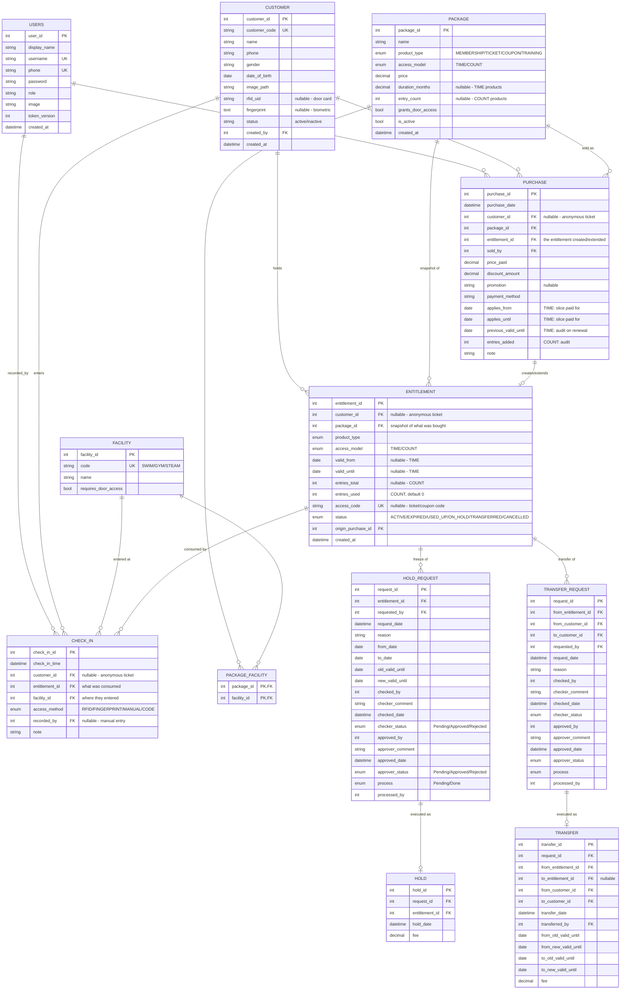

# CKD Database Redesign — Unified Product / Purchase / Entitlement Model

**Status:** Design proposal (no code changes yet)
**Date:** 2026-05-31
**Stack target:** MySQL 8 + TypeORM + type-graphql (unchanged)

---

## 1. Goals & decisions

This redesign collapses the current **5 payment tables + 4 price tables** into one
coherent model built on a single insight:

> **A customer buys a *package* → that creates a *purchase* (the money) → which grants an
> *entitlement* (the right to enter) → and *check-ins* consume that entitlement.**

The only thing that differs between Membership, Ticket, Coupon, and Training is **how access
is measured** — by *time* (valid until a date) or by *count* (a number of entries). One
`entitlement` table holds both, so all four products share the same plumbing.

### Confirmed scope decisions

| Decision | Choice |
|---|---|
| Architecture | **Unified** (Product → Purchase → Entitlement → CheckIn) |
| Deliverable | This design doc + ERD first; code generated after sign-off |
| Hold / Pause workflow | **Kept** (with checker → approver stages) |
| Transfer workflow | **Kept** (with checker → approver stages) |
| Fruit product | **Dropped** (re-addable later as just another `product_type`) |
| Full pricing matrix (Adult/Kid × Old/New × Steam combos × Morning) | **Dropped** as required structure |
| Towel / locker-key tracking | **Dropped** |

### One thing to confirm (I'm choosing this — veto if wrong)

Even though the *pricing matrix* is dropped, a package still needs to declare **which
facilities it opens** (Swim / Gym / Steam), because the door/check-in logic must know what an
entitlement grants. I model this as a small `facility` lookup + `package_facility` join — **not**
as fixed price enums. If you don't want facility-level access at all and a membership simply
means "you're in", say so and I'll remove `facility` / `package_facility` and put a single
`grants_door_access` flag on the package.

---

## 2. Entity-relationship diagram



---

## 3. Table-by-table specification

### 3.1 `users` (staff / operators) — *largely unchanged*
The login accounts that operate the system. Carried over from the current `Users` entity with
no structural change.

### 3.2 `customer` (members / people) — *slimmed down*
The person who buys and enters. **Removed** the denormalized state columns
(`end_membership_date`, `end_fruit_date`, `key_status`, `towel_status`, `shift`) — those are now
**derived** from the customer's entitlements (see §5).

| Column | Type | Notes |
|---|---|---|
| `customer_id` | INT PK | |
| `customer_code` | VARCHAR(50) UNIQUE | business card number |
| `name` | VARCHAR(100) | |
| `phone` | VARCHAR(20) | |
| `gender` | VARCHAR(10) | |
| `date_of_birth` | DATE NULL | replaces hard-coded Adult/Kid; age is computed when needed |
| `image_path` | VARCHAR(255) | |
| `rfid_uid` | VARCHAR(64) NULL | door card UID — the "RFID flow" hook |
| `fingerprint` | TEXT NULL | biometric template |
| `status` | ENUM(`active`,`inactive`) | |
| `created_by` | INT FK → users | |
| `created_at` | DATETIME | |

### 3.3 `facility` (access areas) — *new lookup*
What a customer can physically enter. Seed with `SWIM`, `GYM`, `STEAM`.

### 3.4 `package` (sellable product) — *replaces MemberPriceTable, TrainningPrice, FruitPrice, CouponCard-as-template*
The catalog definition of something you can sell. `product_type` drives behavior; `access_model`
says how it's consumed.

| `product_type` | `access_model` | `duration_months` | `entry_count` |
|---|---|---|---|
| MEMBERSHIP | TIME | 1 / 3 / 6 / 12 | NULL |
| TRAINING | TIME | 1 (monthly) | NULL |
| TICKET | COUNT | NULL | 1 |
| COUPON | COUNT | NULL | 10 / 15 / 20 |

`grants_door_access` + `package_facility` rows declare what the package opens.

### 3.5 `package_facility` — M:N join
Which facilities a package grants. (Membership "Swim+Gym" = two rows.)

### 3.6 `purchase` (the money) — *replaces all 5 `*Payment` tables*
**Every sale, of every type, lands here.** This is the single source of truth for revenue.

- `customer_id` is **nullable** so an anonymous walk-in ticket still records money.
- For TIME renewals, `applies_from` / `applies_until` / `previous_valid_until` capture exactly what
  the payment bought (mirrors your old `old_end` / `new_end`).
- For COUNT top-ups, `entries_added` records how many entries this payment added.

> Revenue today = `SELECT SUM(price_paid) FROM purchase WHERE DATE(purchase_date)=CURDATE();`
> — no more 5-way UNION.

**Money is `DECIMAL(10,2)`, not `double`** — the current schema's `double` prices are a
rounding-bug risk for currency. This is a deliberate fix.

### 3.7 `entitlement` (the right to enter) — *the heart of the model*
What the customer currently *holds*. One row = one grant of access.

- **TIME products** use `valid_from` / `valid_until`. Active if `today ≤ valid_until` and `status=ACTIVE`.
- **COUNT products** use `entries_total` / `entries_used`. Active if `entries_used < entries_total`.
- `access_code` holds the ticket/coupon code (unique) so it can be scanned at the door.
- `status` lifecycle: `ACTIVE → EXPIRED | USED_UP | ON_HOLD | TRANSFERRED | CANCELLED`.

This single table answers "what can this person do right now?" — which today is scattered across
`Customer` columns and 5 payment tables.

### 3.8 `check_in` (entry events) — *replaces MemberScan, TicketLog, CouponLog*
Every entry, of every type, logged once. Crucially it carries **`entitlement_id`** so you finally
know *what was consumed* on each visit (membership day vs. coupon entry vs. ticket), plus
`facility_id` (where) and `access_method` (RFID / fingerprint / manual / scanned code).

### 3.9 `hold_request` + `hold` — *kept*
Freeze a membership for a date range, with checker → approver stages. On processing, the linked
`entitlement.valid_until` is pushed out by `(to_date − from_date)` and may sit in `ON_HOLD` during
the freeze. `hold.fee` feeds a `purchase` row if you charge for holds.

### 3.10 `transfer_request` + `transfer` — *kept*
Move membership time from one customer to another, with checker → approver stages. The `transfer`
row keeps before/after `valid_until` snapshots for **both** sides (`from_*` / `to_*`), preserving
your current "move remaining days" semantics.

---

## 4. The four flows, walked through

### Flow A — Membership (time + facilities + door)
1. Operator picks a `package` (`MEMBERSHIP`, `duration_months=3`, facilities `{SWIM,GYM}`, `grants_door_access=true`).
2. Insert `purchase` (money, `sold_by`, `applies_from=today`, `applies_until=today+3mo`).
3. Insert `entitlement` (`TIME`, `valid_from=today`, `valid_until=today+3mo`, `status=ACTIVE`); link `purchase.entitlement_id`.
4. **Renewal** = new `purchase` pointing at the *same* `entitlement`; push `valid_until` forward; store `previous_valid_until` on the purchase for audit.
5. **Entry**: door reads `rfid_uid` → find customer → find an `ACTIVE` TIME entitlement granting the target `facility` → log `check_in(RFID)` and open. (See §6.)

### Flow B — Ticket (single pass, often anonymous)
1. Pick `package` (`TICKET`, `entry_count=1`).
2. Insert `purchase` (`customer_id` may be NULL).
3. Insert `entitlement` (`COUNT`, `entries_total=1`, `access_code='T-…'`).
4. **Entry**: scan code → `entries_used → 1`, `status → USED_UP`, log `check_in(CODE)`.

### Flow C — Coupon (10 / 15 / 20 entries)
1. Pick `package` (`COUPON`, `entry_count=15`).
2. `purchase` + `entitlement` (`COUNT`, `entries_total=15`, `access_code='C-…'`).
3. **Each entry**: `entries_used += 1`; when it hits `entries_total`, `status → USED_UP`. Each entry is its own `check_in` row.

### Flow D — Training (Gym / Swimming, monthly)
1. Pick `package` (`TRAINING`, `duration_months=1`, facility `{GYM}` or `{SWIM}`).
2. `purchase` + `entitlement` (`TIME`, monthly window).
3. Renew monthly exactly like membership (Flow A step 4).

> A customer can hold **several entitlements at once** (e.g. a Swim membership *and* monthly Gym
> training) — they're just separate `entitlement` rows. Check-in picks whichever active one grants
> the facility being entered.

---

## 5. Derived customer state (replaces the dropped `Customer` columns)

Instead of storing `end_membership_date` etc. on the row, compute it. Example view:

```sql
CREATE VIEW customer_access_summary AS
SELECT
  c.customer_id,
  c.customer_code,
  c.name,
  MAX(CASE WHEN e.product_type='MEMBERSHIP' AND e.status='ACTIVE'
           THEN e.valid_until END)                         AS membership_until,
  SUM(CASE WHEN e.access_model='COUNT' AND e.status='ACTIVE'
           THEN (e.entries_total - e.entries_used) ELSE 0 END) AS entries_remaining,
  MAX(CASE WHEN e.status='ACTIVE' THEN 1 ELSE 0 END)        AS has_active_access
FROM customer c
LEFT JOIN entitlement e ON e.customer_id = c.customer_id
GROUP BY c.customer_id, c.customer_code, c.name;
```

This is always correct (no stale columns to update) and trivially extends to new product types.

---

## 6. RFID / door flow (the part you delegated)

The schema only needs three hooks; the hardware/reader code lives outside the DB:

1. `customer.rfid_uid` — the card UID.
2. `package.grants_door_access` + `package_facility` — does this product open a door, and which?
3. `check_in.access_method = 'RFID'` — the logged event.

**Door reader pseudo-logic:**
```
uid ← reader.read()
customer ← SELECT * FROM customer WHERE rfid_uid = uid
ent ← SELECT * FROM entitlement
        WHERE customer_id = customer.customer_id
          AND status = 'ACTIVE'
          AND access_model = 'TIME'
          AND CURDATE() BETWEEN valid_from AND valid_until
          AND <grants the door's facility>     -- via package_facility
        LIMIT 1
if ent exists:
    INSERT check_in(customer_id, entitlement_id, facility_id, access_method='RFID', check_in_time=NOW())
    open_door()
else:
    deny()   -- expired / no access / wrong facility
```

You wire `reader.read()` and `open_door()`; the schema records and authorizes.

---

## 7. Migration map (old → new)

| Current | New home |
|---|---|
| `Customer` (+ state cols) | `customer` (state cols → derived view §5) |
| `Users` | `users` (unchanged) |
| `MemberPriceTable`, `TrainningPrice`, `FruitPrice` | `package` (+ `package_facility`) |
| `CouponCard` (template part) | `package` (`product_type=COUPON`) |
| `MemberPayment`, `TicketPayment`, `CouponPayment`, `TrainningPayment`, `FruitPayment` | `purchase` (one table) |
| current/expiry state of each payment | `entitlement` |
| `MemberScan`, `TicketLog`, `CouponLog` | `check_in` (one table) |
| `HoldRequest`, `Hold` | `hold_request`, `hold` (now FK to `entitlement`) |
| `TransferRequest`, `Transfer` | `transfer_request`, `transfer` (now FK to `entitlement`) |
| `FruitPayment` / `FruitPrice` | **dropped** (re-add as `product_type=FRUIT` if ever needed) |

### Migration approach (when we get to it)
1. Stand up new tables alongside old (no `synchronize:true` for this — use a real migration).
2. Backfill `package` from the three price tables + coupon cards.
3. Backfill `purchase` from the 5 payment tables (map columns, set `package_id`, money → DECIMAL).
4. Derive `entitlement` rows from the latest state per customer per product.
5. Backfill `check_in` from the scan/log tables.
6. Verify counts & revenue totals match old vs new, then cut over reads, then drop old tables.

---

## 8. Key improvements over the current schema

- **One revenue table** (`purchase`) instead of five — reporting becomes a single query.
- **Real foreign keys** everywhere (currently every `customer_id` is a loose `int`).
- **`DECIMAL` money** instead of `double`/`float` — removes currency rounding risk.
- **Check-ins know what they consumed** (`entitlement_id`) — currently impossible.
- **No stale denormalized state** on `customer` — access is derived and always correct.
- **Extensible**: a new product type = a new `package` row + maybe one enum value. No new tables.

---

## 9. Open questions before code generation

1. **Facilities** — keep `facility` + `package_facility` (my recommendation), or collapse to a single
   `grants_door_access` flag? (See §1.)
2. **Anonymous tickets** — confirm tickets can be sold with no `customer_id` (current `TicketPayment`
   has no customer, so I assumed yes).
3. **Hold/Transfer fees** — should `hold.fee` / `transfer.fee` also create a `purchase` row so they
   show up in revenue? (Recommended: yes.)
4. **Renewal model** — extend one long-lived `entitlement` (my choice, keeps "current access" as one
   row) vs. a new `entitlement` per purchase. Confirm.
5. **Output format for code** — TypeORM entities (matches your stack) or raw SQL DDL?

Once you answer §9, I'll generate the chosen artifact.
